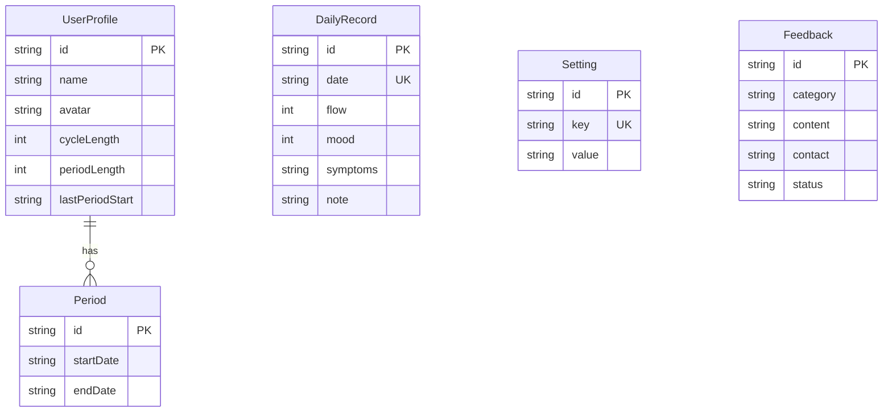

# 🌙 经期来了 (Luna) — 产品功能需求方案

> **产品定位**：一款温暖、私密、科学的女性经期健康管理 Web 应用  
> **设计风格**：Android 风格 · 深色主题 · 圆润卡片 · 渐变色彩  
> **技术栈**：Next.js 16 + TypeScript + Prisma (SQLite) + Tailwind CSS + Framer Motion

---

## 一、产品概述

### 1.1 产品愿景
帮助女性轻松记录经期数据、了解生理周期规律、获得个性化健康建议，成为女性贴心的健康伙伴。

### 1.2 目标用户
- 有经期记录需求的女性用户
- 关注自身生理健康的人群
- 备孕/避孕人群（需了解排卵期/易孕期）

### 1.3 核心价值
| 维度 | 价值主张 |
|------|----------|
| 📊 数据记录 | 简洁快速记录经期、症状、情绪，一目了然 |
| 🔮 智能预测 | 基于历史数据精准预测下次经期与排卵期 |
| 💡 健康建议 | 根据周期阶段提供个性化养生小贴士 |
| 🔒 隐私安全 | 数据本地存储，支持加密与隐私模式 |

---

## 二、功能模块总览

```
经期来了 (Luna)
├── 🏠 首页 (Home)
├── 📅 日历 (Calendar)
├── 📝 记录 (Log)
├── 👤 我的 (Profile)
└── ⚙️ 全局功能
    ├── 数据层 (API + Database)
    ├── 通知提醒系统
    └── 数据管理与导出
```

---

## 三、功能模块详细需求

---

### 3.1 🏠 首页 (Home Tab)

#### 3.1.1 日期头部
| 需求项 | 说明 | 状态 |
|--------|------|------|
| 今日日期展示 | 显示中文格式日期（如：3月4日 周二） | ✅ 已实现 |
| 通知入口 | 右上角铃铛图标，进入通知中心 | ✅ UI已实现 |

#### 3.1.2 周期阶段卡片
| 需求项 | 说明 | 状态 |
|--------|------|------|
| 当前阶段展示 | 显示当前所处的周期阶段名称、天数 | ✅ 已实现 |
| 阶段颜色标识 | 经期(珊瑚红)、卵泡期(薄荷绿)、排卵期(暖金)、黄体期(柔黄) | ✅ 已实现 |
| 阶段描述 | 显示阶段简述（如"休养期""能量回升期"） | ✅ 已实现 |
| 阶段健康提示 | 根据当前阶段展示对应健康建议 | ✅ 已实现 |
| 阶段图标 | 每个阶段对应emoji图标（🩸🌱✨🌙） | ✅ 已实现 |

#### 3.1.3 周期环形图
| 需求项 | 说明 | 状态 |
|--------|------|------|
| 环形进度条 | SVG 实现的圆环，渐变色进度 | ✅ 已实现 |
| 进度动画 | 页面加载时环形进度动画展开 | ✅ 已实现 |
| 刻度标记 | 28个刻度标记，对应周期天数 | ✅ 已实现 |
| 中心数字 | 显示距下次经期的天数 | ✅ 已实现 |
| 辉光效果 | 进度条外围发光效果 | ✅ 已实现 |

#### 3.1.4 统计数据网格
| 需求项 | 说明 | 状态 |
|--------|------|------|
| 周期长度 | 显示平均周期长度（天） | ✅ 已实现 |
| 经期长度 | 显示平均经期长度（天） | ✅ 已实现 |
| 总周期数 | 显示已记录的总周期数 | ⬜ 待实现 |
| 连续记录天数 | 显示连续记录打卡天数 | ⬜ 待实现 |

#### 3.1.5 周期阶段时间轴
| 需求项 | 说明 | 状态 |
|--------|------|------|
| 阶段条形图 | 水平分段展示经期/卵泡期/排卵期/黄体期占比 | ✅ 已实现 |
| 当前阶段高亮 | 当前阶段发光高亮显示 | ✅ 已实现 |
| 阶段标签 | 条形图下方标注各阶段名称 | ✅ 已实现 |

#### 3.1.6 最近记录
| 需求项 | 说明 | 状态 |
|--------|------|------|
| 最近3条记录 | 显示最近3条日常记录摘要 | ✅ 已实现 |
| 情绪图标 | 每条记录显示对应情绪emoji | ✅ 已实现 |
| 症状标签 | 显示前2个症状标签，超出部分显示+N | ✅ 已实现 |
| 流量标签 | 显示流量等级文字 | ✅ 已实现 |
| 查看全部 | 跳转至记录页历史记录标签 | ✅ 已实现 |

#### 3.1.7 今日小贴士
| 需求项 | 说明 | 状态 |
|--------|------|------|
| 阶段匹配贴士 | 根据当前阶段展示对应的健康小贴士 | ✅ 已实现 |
| 每阶段5条贴士 | 经期/卵泡期/排卵期/黄体期各5条 | ✅ 已实现 |
| 换一条 | 点击切换下一条贴士 | ✅ 已实现 |
| 动画切换 | 贴士切换时渐入动画 | ✅ 已实现 |

#### 3.1.8 周期趋势图
| 需求项 | 说明 | 状态 |
|--------|------|------|
| 柱状图 | 展示最近6个周期长度的柱状图 | ✅ 已实现 |
| 最新周期高亮 | 最新周期用渐变色高亮 | ✅ 已实现 |
| 平均值标注 | 显示平均周期天数 | ✅ 已实现 |

#### 3.1.9 待扩展功能
| 需求项 | 说明 | 优先级 |
|--------|------|--------|
| 经期倒计时小组件 | 大号天数+日期显示 | P1 |
| 体温曲线图 | 基础体温折线图（需新增体温记录） | P2 |
| 白带记录 | 记录白带状态（量/颜色/质地） | P2 |
| 体重记录 | 记录体重变化曲线 | P3 |
| 睡眠记录 | 记录睡眠时长和质量 | P3 |
| 用药提醒 | 避孕药/中药等用药提醒 | P2 |

---

### 3.2 📅 日历 (Calendar Tab)

#### 3.2.1 月份导航
| 需求项 | 说明 | 状态 |
|--------|------|------|
| 月份切换 | 左右箭头切换月份 | ✅ 已实现 |
| 当前月份标题 | 显示"YYYY年M月" | ✅ 已实现 |
| 回到今天 | 非当月时显示"回到今天"按钮 | ✅ 已实现 |

#### 3.2.2 日历网格
| 需求项 | 说明 | 状态 |
|--------|------|------|
| 星期标题行 | 日/一/二/三/四/五/六 | ✅ 已实现 |
| 周末颜色区分 | 周日和周六标题用浅红色 | ✅ 已实现 |
| 经期标记 | 经期日期实心红色背景 | ✅ 已实现 |
| 经期连续样式 | 经期首尾日期圆角，中间日期方角 | ✅ 已实现 |
| 当前经期脉冲 | 进行中的经期日期有脉冲动画 | ✅ 已实现 |
| 预测经期标记 | 预测经期日期半透明绿色+虚线边框 | ✅ 已实现 |
| 易孕期标记 | 易孕期日期半透明金色 | ✅ 已实现 |
| 今天高亮 | 今日日期金色渐变背景+放大 | ✅ 已实现 |
| 日期点击 | 点击日期弹出操作面板 | ✅ 已实现 |
| 非当月日期留空 | 非当前月份日期显示为空位 | ✅ 已实现 |

#### 3.2.3 日历图例
| 需求项 | 说明 | 状态 |
|--------|------|------|
| 经期图例 | 红色实心 → 经期 | ✅ 已实现 |
| 预测经期图例 | 绿色虚线 → 预测经期 | ✅ 已实现 |
| 易孕期图例 | 金色实心 → 易孕期 | ✅ 已实现 |
| 排卵日标记 | 图例中增加排卵日标记说明 | ⬜ 待实现 |

#### 3.2.4 周期历史
| 需求项 | 说明 | 状态 |
|--------|------|------|
| 最近5次经期 | 列表展示最近5次经期时间段 | ✅ 已实现 |
| 经期天数 | 每次经期显示持续天数或"进行中" | ✅ 已实现 |
| 进行中标识 | 当前经期显示"进行中"标签 | ✅ 已实现 |

#### 3.2.5 待扩展功能
| 需求项 | 说明 | 优先级 |
|--------|------|--------|
| 日历日期悬停预览 | 长按/悬停日期显示当日记录摘要 | P1 |
| 月度经期摘要 | 当月经期天数/预测天数统计 | P2 |
| 日历手势操作 | 左右滑动切换月份 | P2 |
| 多选日期 | 支持选择多个日期批量标记经期 | P3 |
| 周视图模式 | 日历支持周视图/月视图切换 | P3 |

---

### 3.3 📝 记录 (Log Tab)

#### 3.3.1 标签切换
| 需求项 | 说明 | 状态 |
|--------|------|------|
| 记录/历史切换 | 顶部双标签切换 | ✅ 已实现 |
| 当前标签高亮 | 激活标签有背景色标识 | ✅ 已实现 |

#### 3.3.2 流量记录
| 需求项 | 说明 | 状态 |
|--------|------|------|
| 4级流量选择 | 点滴/少量/中等/大量 | ✅ 已实现 |
| 圆点大小递增 | 不同等级用不同大小的圆点表示 | ✅ 已实现 |
| 选中高亮 | 选中项有红色边框和发光效果 | ✅ 已实现 |

#### 3.3.3 症状记录
| 需求项 | 说明 | 状态 |
|--------|------|------|
| 预设症状 | 痛经/腰酸/头痛/疲劳/腹胀/乳房胀痛 | ✅ 已实现 |
| 多选标签 | 可同时选择多个症状 | ✅ 已实现 |
| 选中高亮 | 选中项红色边框高亮 | ✅ 已实现 |
| 自定义症状 | 点击"+"添加自定义症状 | ✅ 已实现 |
| 自定义弹窗 | 底部弹窗输入自定义症状名称 | ✅ 已实现 |

#### 3.3.4 情绪记录
| 需求项 | 说明 | 状态 |
|--------|------|------|
| 5级情绪选择 | 开心😊/平静😌/低落😔/烦躁😤/焦虑😰 | ✅ 已实现 |
| Emoji 图标 | 每种情绪对应一个emoji | ✅ 已实现 |
| 选中高亮 | 选中项红色边框高亮 | ✅ 已实现 |

#### 3.3.5 备注记录
| 需求项 | 说明 | 状态 |
|--------|------|------|
| 文本输入框 | 多行文本输入区域 | ✅ 已实现 |
| 占位提示 | "记录更多细节..."提示文字 | ✅ 已实现 |
| 聚焦样式 | 聚焦时边框变色 | ✅ 已实现 |

#### 3.3.6 保存记录
| 需求项 | 说明 | 状态 |
|--------|------|------|
| 保存按钮 | 渐变色大按钮"保存记录" | ✅ 已实现 |
| 保存交互 | 按压时缩放反馈 | ✅ 已实现 |
| Toast提示 | 保存成功/失败提示 | ✅ 已实现 |
| Upsert逻辑 | 同一日期记录自动覆盖更新 | ✅ 已实现 |

#### 3.3.7 历史记录
| 需求项 | 说明 | 状态 |
|--------|------|------|
| 记录列表 | 所有记录按日期倒序展示 | ✅ 已实现 |
| 今日标记 | 今日记录有特殊背景和"今天"标签 | ✅ 已实现 |
| 流量条形图 | 每条记录用小柱形图显示流量等级 | ✅ 已实现 |
| 症状标签 | 显示所有症状标签 | ✅ 已实现 |
| 备注内容 | 显示备注文字 | ✅ 已实现 |
| 删除按钮 | 每条记录右侧有删除按钮 | ✅ 已实现 |
| 删除确认 | 删除前弹出确认对话框 | ✅ 已实现 |
| 空状态 | 无记录时显示空状态引导 | ✅ 已实现 |

#### 3.3.8 待扩展功能
| 需求项 | 说明 | 优先级 |
|--------|------|--------|
| 记录编辑 | 点击历史记录进入编辑模式 | P1 |
| 基础体温 | 记录每日基础体温值 | P2 |
| 白带状态 | 记录白带量/颜色/质地 | P2 |
| 性生活记录 | 记录性生活及防护措施 | P2 |
| 饮食记录 | 记录当日饮食偏好 | P3 |
| 运动记录 | 记录运动类型和时长 | P3 |
| 照片附件 | 记录中附加照片（如皮肤状态） | P3 |
| 记录模板 | 常用记录一键填充模板 | P3 |

---

### 3.4 👤 我的 (Profile Tab)

#### 3.4.1 用户信息
| 需求项 | 说明 | 状态 |
|--------|------|------|
| 头像展示 | 圆形头像，有头像显示图片，无头像显示首字母 | ✅ 已实现 |
| 头像上传 | 点击相机按钮上传头像图片 | ✅ 已实现 |
| 头像删除 | 点击X按钮移除已上传头像 | ✅ 已实现 |
| 图片大小限制 | 上传图片不超过2MB | ✅ 已实现 |
| Base64存储 | 头像以Base64 Data URL存储 | ✅ 已实现 |
| 用户名展示 | 显示用户昵称 | ✅ 已实现 |
| 统计摘要 | 显示"已记录X天 · Y个周期" | ✅ 已实现 |
| 编辑入口 | 右侧编辑按钮进入编辑面板 | ✅ 已实现 |

#### 3.4.2 个人资料编辑
| 需求项 | 说明 | 状态 |
|--------|------|------|
| 编辑弹窗 | 底部Sheet形式编辑面板 | ✅ 已实现 |
| 头像编辑 | 圆形头像预览+上传/删除 | ✅ 已实现 |
| 昵称编辑 | 文本输入修改昵称 | ✅ 已实现 |
| 周期长度 | 数字输入调整周期长度 | ✅ 已实现 |
| 经期长度 | 数字输入调整经期长度 | ✅ 已实现 |
| 保存逻辑 | 保存后更新到数据库 | ✅ 已实现 |

#### 3.4.3 健康档案
| 需求项 | 说明 | 状态 |
|--------|------|------|
| 平均周期 | 显示平均周期长度 | ✅ 已实现 |
| 平均经期 | 显示平均经期长度 | ✅ 已实现 |
| 上次经期 | 显示上次经期开始日期 | ✅ 已实现 |
| 周期规律 | 显示周期是否规律 | ✅ 已实现(固定"规律") |

#### 3.4.4 提醒设置
| 需求项 | 说明 | 状态 |
|--------|------|------|
| 经期提醒 | 经期开始前1天提醒 | ✅ 已实现(开关) |
| 记录提醒 | 每日21:00提醒记录 | ✅ 已实现(开关) |
| 排卵期提醒 | 易孕期开始时提醒 | ✅ 已实现(开关) |
| 开关切换 | 自定义Toggle开关组件 | ✅ 已实现 |

#### 3.4.5 隐私与安全
| 需求项 | 说明 | 状态 |
|--------|------|------|
| 应用锁 | Face ID/指纹解锁（开关） | ✅ 已实现(开关) |
| 隐私模式 | 伪装成计算器图标 | ⬜ 待实现(占位) |
| 数据加密 | 端到端加密存储 | ⬜ 待实现(占位) |

#### 3.4.6 外观主题
| 需求项 | 说明 | 状态 |
|--------|------|------|
| 深色模式 | 深色/浅色切换 | ✅ 已实现(开关) |
| 主题颜色 | 自定义界面配色 | ⬜ 待实现(占位) |

#### 3.4.7 数据管理
| 需求项 | 说明 | 状态 |
|--------|------|------|
| 导出数据 | 导出为CSV文件 | ✅ 已实现 |
| 云同步 | 连接云端备份 | ⬜ 待实现(占位) |
| 恢复数据 | 从备份恢复 | ⬜ 待实现(占位) |

#### 3.4.8 其他
| 需求项 | 说明 | 状态 |
|--------|------|------|
| 语言设置 | 简体中文 | ⬜ 待实现(占位) |
| 关于我们 | 版本 1.0.0 | ⬜ 待实现(占位) |
| 意见反馈 | 打开反馈提交面板 | ✅ 已实现 |

#### 3.4.9 意见反馈
| 需求项 | 说明 | 状态 |
|--------|------|------|
| 反馈弹窗 | 底部Sheet形式反馈面板 | ✅ 已实现 |
| 分类选择 | 功能建议/问题反馈/体验优化/其他 | ✅ 已实现 |
| 内容输入 | 文本区域，最多500字 | ✅ 已实现 |
| 字数统计 | 实时显示已输入字数 | ✅ 已实现 |
| 联系方式 | 可选填写联系方式 | ✅ 已实现 |
| 提交功能 | 提交到数据库，状态标记为pending | ✅ 已实现 |
| 提交动画 | 提交按钮loading状态 | ✅ 已实现 |

#### 3.4.10 待扩展功能
| 需求项 | 说明 | 优先级 |
|--------|------|--------|
| 周期规律智能判断 | 基于历史数据自动判断周期规律性 | P1 |
| 主题颜色选择 | 提供多套配色方案选择 | P2 |
| 头像图片压缩 | 上传前自动压缩图片大小 | P1 |
| 账号系统 | 支持注册/登录/多设备同步 | P2 |
| 个人健康报告 | 生成月度/年度健康报告 | P2 |
| 服药提醒 | 避孕药/维生素等服药提醒 | P2 |
| 医生咨询 | 在线咨询入口 | P3 |

---

### 3.5 🎯 全局交互功能

#### 3.5.1 经期操作面板 (Action Sheet)
| 需求项 | 说明 | 状态 |
|--------|------|------|
| 底部弹出面板 | 点击日历日期弹出操作面板 | ✅ 已实现 |
| 标记经期开始 | 将选中日期标记为经期开始 | ✅ 已实现 |
| 标记经期结束 | 将选中日期标记为经期结束 | ✅ 已实现 |
| 修改开始日期 | 修改已有经期的开始日期 | ✅ 已实现 |
| 取消当前经期 | 取消进行中的经期 | ✅ 已实现 |
| 延长经期 | 延长当前经期结束日期 | ✅ 已实现 |
| 条件显示 | 根据日期状态动态显示不同操作选项 | ✅ 已实现 |

#### 3.5.2 删除确认对话框
| 需求项 | 说明 | 状态 |
|--------|------|------|
| 确认弹窗 | 删除记录前弹出确认 | ✅ 已实现 |
| 取消操作 | 可取消删除 | ✅ 已实现 |
| 确认删除 | 确认后删除记录 | ✅ 已实现 |

#### 3.5.3 底部导航栏
| 需求项 | 说明 | 状态 |
|--------|------|------|
| 4个Tab | 首页/日历/记录/我的 | ✅ 已实现 |
| 图标+文字 | 每个Tab有图标和文字 | ✅ 已实现 |
| 激活状态 | 当前Tab图标和文字高亮 | ✅ 已实现 |
| 快速记录按钮 | 中间突出的"+"按钮，一键开始记录 | ✅ 已实现 |

#### 3.5.4 页面切换动画
| 需求项 | 说明 | 状态 |
|--------|------|------|
| Tab切换动画 | 左右滑动切换动画 | ✅ 已实现 |
| 入场渐入动画 | 内容元素依次渐入(StaggerIn) | ✅ 已实现 |
| 弹窗滑入动画 | Sheet组件从底部滑入 | ✅ 已实现 |

#### 3.5.5 全局加载
| 需求项 | 说明 | 状态 |
|--------|------|------|
| 加载遮罩 | 数据加载时显示Loading遮罩 | ✅ 已实现 |
| 品牌Logo | 加载时显示Luna Logo | ✅ 已实现 |

---

### 3.6 ⚙️ 数据层 (API + Database)

#### 3.6.1 数据模型

| 模型 | 字段 | 说明 |
|------|------|------|
| **UserProfile** | id, name, avatar, cycleLength, periodLength, lastPeriodStart, createdAt, updatedAt | 用户资料 |
| **Period** | id, startDate, endDate, createdAt, updatedAt | 经期记录 |
| **DailyRecord** | id, date(unique), flow, mood, symptoms(JSON), note, createdAt, updatedAt | 每日记录 |
| **Setting** | id, key(unique), value | 系统设置 |
| **Feedback** | id, category, content, contact, status, createdAt, updatedAt | 用户反馈 |

#### 3.6.2 API 接口

| 接口 | 方法 | 说明 | 状态 |
|------|------|------|------|
| `/api/periods` | GET | 获取所有经期记录（按开始日期倒序） | ✅ 已实现 |
| `/api/periods` | POST | 创建新经期记录 | ✅ 已实现 |
| `/api/periods/[id]` | PUT | 更新经期记录（修改日期/结束经期） | ✅ 已实现 |
| `/api/periods/[id]` | DELETE | 删除经期记录 | ✅ 已实现 |
| `/api/records` | GET | 获取所有日常记录（按日期倒序） | ✅ 已实现 |
| `/api/records` | POST | 创建/更新日常记录（Upsert by date） | ✅ 已实现 |
| `/api/records/[date]` | DELETE | 删除指定日期记录 | ✅ 已实现 |
| `/api/profile` | GET | 获取用户资料（无则创建默认） | ✅ 已实现 |
| `/api/profile` | PUT | 更新用户资料 | ✅ 已实现 |
| `/api/settings` | GET | 获取所有设置项 | ✅ 已实现 |
| `/api/settings` | PUT | 更新设置项（Upsert by key） | ✅ 已实现 |
| `/api/feedback` | GET | 获取所有反馈 | ✅ 已实现 |
| `/api/feedback` | POST | 提交新反馈 | ✅ 已实现 |
| `/api/seed` | POST | 初始化种子数据 | ✅ 已实现 |

---

### 3.7 🔔 通知提醒系统

| 需求项 | 说明 | 状态 |
|--------|------|------|
| 经期提前1天提醒 | 推送通知提醒经期即将到来 | ⬜ 待实现 |
| 每日记录提醒 | 每晚21:00推送提醒记录 | ⬜ 待实现 |
| 排卵期提醒 | 易孕期开始时推送通知 | ⬜ 待实现 |
| 提醒时间自定义 | 用户可自定义提醒时间 | ⬜ 待实现 |
| 免打扰时段 | 设置免打扰时间段 | ⬜ 待实现 |

---

## 四、核心算法逻辑

### 4.1 周期阶段计算

```
周期阶段划分：
├── 经期 (Period)     → 第1天 ~ 第periodLength天
├── 卵泡期 (Follicular) → 第(periodLength+1)天 ~ 第13天
├── 排卵期 (Ovulation)  → 第14天 ~ 第16天
└── 黄体期 (Luteal)    → 第17天 ~ 第cycleLength天
```

### 4.2 经期预测算法

```
预测逻辑：
1. 如果有活跃经期（endDate为null）→ 当前处于经期中
2. 基于最近一次经期开始日期 + 平均周期长度 = 预测下次经期
3. 预测经期天数 = 用户设置的periodLength
4. 排卵日 ≈ 下次经期前14天
5. 易孕期 = 排卵日前5天 ~ 排卵日后1天
```

### 4.3 统计计算

```
统计数据：
├── 平均周期 = 所有已完成周期长度的平均值
├── 平均经期 = 所有已完成经期天数的平均值
├── 总周期数 = 已完成经期次数
└── 周期趋势 = 最近6个周期长度的变化趋势
```

---

## 五、设计规范

### 5.1 色彩体系

| 用途 | 色值 | 说明 |
|------|------|------|
| 背景 | `#0f1419` | 主背景色 |
| 卡片背景 | `#232b35` | 卡片/面板背景 |
| 深层背景 | `#1a2027` | 嵌套层背景 |
| 主文字 | `#f0ece4` | 主要文字 |
| 次文字 | `#a8a29e` | 次要文字 |
| 辅助文字 | `#6b7280` | 辅助说明文字 |
| 经期色 | `#e07a5f` | 珊瑚红 |
| 卵泡期色 | `#81b29a` | 薄荷绿 |
| 排卵期色 | `#d4a574` | 暖金 |
| 黄体期色 | `#f2cc8f` | 柔黄 |
| 强调色 | `linear-gradient(135deg, #e07a5f, #d4a574)` | 主操作按钮渐变 |

### 5.2 圆角规范

| 元素 | 圆角 |
|------|------|
| 卡片/面板 | `20px` (rounded-[20px]) |
| 小图标容器 | `12px` (rounded-xl) |
| 按钮/标签 | `12px` (rounded-xl) |
| 头像 | `50%` (rounded-full) |
| Toggle开关 | `full` (rounded-full) |

### 5.3 字体规范

| 用途 | 字体 | 大小 |
|------|------|------|
| 大标题 | Georgia, serif | text-2xl / text-4xl |
| 卡片标题 | 系统字体 | text-sm font-medium |
| 正文 | 系统字体 | text-sm |
| 辅助文字 | 系统字体 | text-xs |
| 数据数字 | Georgia, serif | text-2xl / text-4xl font-light |

### 5.4 动画规范

| 场景 | 动画 | 参数 |
|------|------|------|
| 页面切换 | 水平滑动+渐入 | duration: 0.3s |
| 元素入场 | 垂直渐入(StaggerIn) | duration: 0.5s, delay递增 |
| 数字变化 | 弹性缩放 | spring: stiffness:300, damping:25 |
| 按钮点击 | 缩放 | whileTap: scale:0.97 |
| 面板滑入 | 底部滑入 | spring动画 |
| 经期脉冲 | 脉冲动画 | 2s ease-in-out infinite |

---

## 六、功能实现状态总览

### 6.1 已完成功能 (✅)

| 模块 | 功能 | 备注 |
|------|------|------|
| 首页 | 日期头部、周期阶段卡片、环形图、统计、时间轴、记录、贴士、趋势图 | 完整 |
| 日历 | 月份导航、日历网格、经期/预测/易孕标记、图例、周期历史 | 完整 |
| 记录 | 流量/症状/情绪/备注记录、保存、历史列表、删除 | 完整 |
| 我的 | 用户信息、头像上传、资料编辑、健康档案、提醒设置、隐私安全、外观主题、数据导出、意见反馈 | 完整 |
| 全局 | 底部导航、Tab切换动画、操作面板、加载遮罩 | 完整 |
| 数据层 | 全部5个数据模型、13个API接口 | 完整 |

### 6.2 待实现功能 (⬜) — 按优先级排序

#### P0 — 核心体验优化
| 功能 | 模块 | 说明 |
|------|------|------|
| 新用户引导流程 | 全局 | 首次使用时引导用户设置基本信息和记录首次经期 |
| SVG水合错误修复 | 首页 | 环形图刻度标记浮点数导致的SSR/CSR不一致 |
| 头像图片压缩 | 我的 | 上传前自动压缩图片减少存储占用 |

#### P1 — 重要功能完善
| 功能 | 模块 | 说明 |
|------|------|------|
| 记录编辑功能 | 记录 | 点击历史记录进入编辑模式修改 |
| 周期规律智能判断 | 我的 | 基于历史数据自动判断周期是否规律 |
| 日历日期预览 | 日历 | 点击日期显示当日记录摘要浮窗 |
| 首页统计扩展 | 首页 | 增加总周期数、连续记录天数卡片 |
| 经期倒计时小组件 | 首页 | 醒目的大号倒计时显示 |

#### P2 — 功能增强
| 功能 | 模块 | 说明 |
|------|------|------|
| 基础体温记录与曲线 | 首页+记录 | 记录每日基础体温并绘制折线图 |
| 白带状态记录 | 记录 | 记录白带量/颜色/质地 |
| 性生活记录 | 记录 | 记录性生活及防护措施 |
| 主题颜色选择 | 我的 | 提供多套配色方案选择 |
| 月度经期摘要 | 日历 | 当月经期天数/预测天数统计 |
| 日历手势操作 | 日历 | 左右滑动切换月份 |
| 通知提醒实现 | 全局 | 实现经期/记录/排卵期提醒推送 |
| 云同步 | 我的 | 支持数据云端备份 |
| 个人健康报告 | 我的 | 生成月度/年度健康分析报告 |
| 服药提醒 | 我的 | 避孕药/维生素等服药提醒 |
| 账号系统 | 我的 | 支持注册/登录/多设备同步 |

#### P3 — 锦上添花
| 功能 | 模块 | 说明 |
|------|------|------|
| 体重记录与曲线 | 首页+记录 | 记录体重变化 |
| 睡眠记录 | 记录 | 记录睡眠时长和质量 |
| 饮食记录 | 记录 | 记录当日饮食偏好 |
| 运动记录 | 记录 | 记录运动类型和时长 |
| 照片附件 | 记录 | 记录中附加照片 |
| 记录模板 | 记录 | 常用记录一键填充 |
| 周视图模式 | 日历 | 支持周视图/月视图切换 |
| 多选日期 | 日历 | 批量标记经期 |
| 医生咨询入口 | 我的 | 在线咨询功能 |
| 社区互动 | 全局 | 用户间经验分享社区 |
| AI智能问答 | 全局 | 基于用户数据的AI健康咨询 |

---

## 七、技术架构

### 7.1 前端架构

```
src/
├── app/
│   ├── page.tsx              # 主页面（状态管理 + 布局渲染）
│   └── api/                  # API 路由
│       ├── periods/          # 经期 CRUD
│       ├── records/          # 记录 CRUD
│       ├── profile/          # 用户资料
│       ├── settings/         # 设置项
│       ├── feedback/         # 意见反馈
│       └── seed/             # 种子数据
├── components/
│   ├── luna/                 # Luna 业务组件
│   │   ├── shared.tsx        # 公共类型/常量/工具函数
│   │   ├── HomeTab.tsx       # 首页
│   │   ├── CalendarTab.tsx   # 日历
│   │   ├── LogTab.tsx        # 记录
│   │   ├── ProfileTab.tsx    # 我的
│   │   ├── ActionSheet.tsx   # 经期操作面板
│   │   ├── SymptomSheet.tsx  # 自定义症状面板
│   │   ├── ProfileEditSheet.tsx  # 资料编辑面板
│   │   ├── FeedbackSheet.tsx # 意见反馈面板
│   │   └── DeleteConfirmDialog.tsx # 删除确认对话框
│   └── ui/                   # shadcn/ui 基础组件
├── hooks/
│   └── use-toast.ts          # Toast 通知 Hook
└── lib/
    └── db.ts                 # Prisma 客户端
```

### 7.2 数据库架构



### 7.3 技术选型

| 技术 | 版本/方案 | 用途 |
|------|-----------|------|
| Next.js | 16 (App Router) | 全栈框架 |
| TypeScript | 5 | 类型安全 |
| Tailwind CSS | 4 | 样式系统 |
| Prisma | latest | ORM + SQLite |
| Framer Motion | latest | 动画系统 |
| Lucide React | latest | 图标库 |
| shadcn/ui | New York | UI组件库 |
| Zustand | — | 状态管理(待引入) |
| TanStack Query | — | 服务端状态(待引入) |

---

## 八、版本规划

### v1.0 — MVP (当前版本)
- [x] 经期记录与追踪
- [x] 日历视图
- [x] 日常健康记录（流量/症状/情绪/备注）
- [x] 个人资料管理
- [x] 基础统计与趋势图
- [x] 数据导出(CSV)
- [x] 意见反馈

### v1.1 — 体验优化
- [ ] 新用户引导流程
- [ ] 记录编辑功能
- [ ] 周期规律智能判断
- [ ] 头像压缩
- [ ] 日历日期预览
- [ ] 修复已知Bug

### v1.2 — 功能增强
- [ ] 基础体温记录与曲线
- [ ] 白带/性生活记录
- [ ] 主题颜色自定义
- [ ] 通知提醒实现
- [ ] 月度经期摘要

### v2.0 — 社交与云
- [ ] 账号系统与云同步
- [ ] 个人健康报告
- [ ] 服药提醒
- [ ] 社区互动功能
- [ ] AI智能问答

---

> **文档版本**：v1.0  
> **最后更新**：2026-03-04  
> **维护者**：Luna 开发团队
